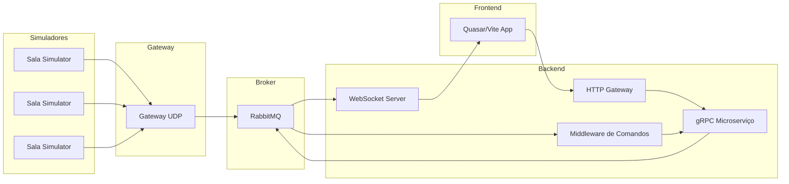

# SmartCampus Solutions – Plataforma Distribuída de Monitoramento e Controle

Este repositório implementa uma plataforma distribuída para monitoramento e controle em tempo real de ambientes inteligentes em um campus universitário. A solução integra simuladores de salas, gateway UDP, mensageria RabbitMQ, microsserviços gRPC, WebSocket, HTTP Gateway e um frontend Quasar/Vite.

---

## Arquitetura Geral



1. **Simuladores de Salas** (arquivo `salas.py`)

   - Envia periodicamente (5s) via UDP dados de temperatura, presença e estado do ar-condicionado.
   - Escuta comandos UDP para alterar o estado interno do ar-condicionado.

2. **Gateway UDP** (`gateway_udp.py`)

   - Recebe pacotes UDP de simuladores e publica em fila `dados_sensores` do RabbitMQ.
   - Consome a mesma fila, filtra comandos e envia UDP para o simulador correto.

3. **RabbitMQ**

   - Fila única `dados_sensores` usada para sensoreamento e comandos.

4. **WebSocket Server** (`websocket_server.py`)

   - Consome `dados_sensores` e faz broadcast em tempo real para clientes WebSocket (frontend).

5. **Microsserviço gRPC** (`microservico.py`)

   - Expõe `ObterDadosAmbiente` e `ControlarArCondicionado`.
   - Atualiza estado local e empurra comandos de volta à RabbitMQ via fila thread-safe.

6. **Middleware de Comandos** (`middleware.py`)

   - Consome `dados_sensores` apenas comandos, chama o gRPC e atualiza estado via RabbitMQ.

7. **HTTP Gateway** (`http_gateway.py`)

   - Rota `/api/ac` para ligar/desligar ar-condicionado.
   - Converte JSON em chamada gRPC, retorna status ao frontend.

8. **Frontend Quasar/Vite** (`EnvironmentMonitor.vue`, `src/boot/axios.js`)

   - Conecta via WebSocket a `ws://localhost:8765` para receber dados em tempo real.
   - Usa Axios para POST `/api/ac` ao HTTP Gateway.
   - Exibe cards com temperatura, presença e estado do ar-condicionado, e botões de controle.

---

## Pré-requisitos

- **Python 3.11+**
- **Node.js 18+** e **Quasar CLI** (`npm install -g @quasar/cli`)
- **RabbitMQ** (via Homebrew)
- Bibliotecas Python (veja `requirements.txt` em cada pasta):
  ```bash
  pip install flask flask-cors grpcio grpcio-tools pika websockets
  ```
- **Protoc** / **grpcio-tools** para gerar stubs Python:
  ```bash
  python -m grpc_tools.protoc -I=protos --python_out=. --grpc_python_out=. protos/service.proto
  ```

---

## Estrutura de Diretórios

```
smartcampus-backend/
├── protos/
│   └── service.proto
├── salas.py
├── gateway_udp.py
├── microservico.py
├── middleware.py
├── websocket_server.py
├── http_gateway.py
└── requirements.txt      # global ou em cada subdir

smartcampus-frontend/
├── quasar.config.js
├── src/
│   ├── pages/EnvironmentMonitor.vue
│   ├── boot/axios.js
│   ├── router/routes.js
│   └── ...
└── package.json
```

---

## Executando a Plataforma

1. **Iniciar RabbitMQ** (AirDropped se necessário):

   ```bash
   brew services start rabbitmq
   ```

2. **Rodar Simuladores de Salas**:

   ```bash
   python salas.py
   ```

3. **Rodar Gateway UDP**:

   ```bash
   python gateway_udp.py
   ```

4. **Rodar Microserviço gRPC**:

   ```bash
   python microservico.py
   ```

5. **Rodar Middleware de Comandos**:

   ```bash
   python middleware.py
   ```

6. **Rodar WebSocket Server**:

   ```bash
   python websocket_server.py
   ```

7. **Rodar HTTP Gateway**:

   ```bash
   python http_gateway.py
   ```

8. **Rodar Frontend Quasar**:

   ```bash
   cd smartcampus-frontend
   quasar dev
   ```

Acesse `http://localhost:8080/#/monitor` para visualizar o painel.

---

## Testes e Debug

- **Logs**: verifique consoles de cada componente para mensagens de debug.
- **cURL**: simule comandos:
  ```bash
  curl -X POST http://127.0.0.1:8000/api/ac \
    -H 'Content-Type: application/json' \
    -d '{"sala_id":1,"comando":"ligar"}'
  ```

